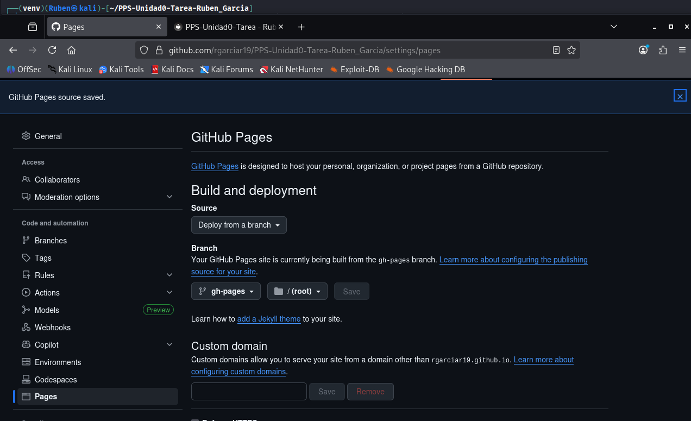

# 🌐 Fase 3: Publicación con GitHub Pages

Una vez que el WorkFlow de GitHub Actions genera la rama `gh-pages` con los archivos HTML estáticos de MkDocs, el último paso para publicar la documentación es configurar GitHub Pages para que sirva esos archivos.

## 1. Configuración de la Fuente de Despliegue

Desde la sección **Settings -> Pages** del repositorio, se configuró la fuente de despliegue para usar la rama `gh-pages`, que es creada y actualizada por el WorkFlow de GitHub Actions.

## 2. Documentación Publicada

Tras guardar la configuración, GitHub Pages desplegó automáticamente los archivos. La documentación ahora está accesible públicamente en la siguiente URL, confirmando la finalización exitosa de la automatización:

**URL de la Documentación:** [Pega aquí tu URL de GitHub Pages]

